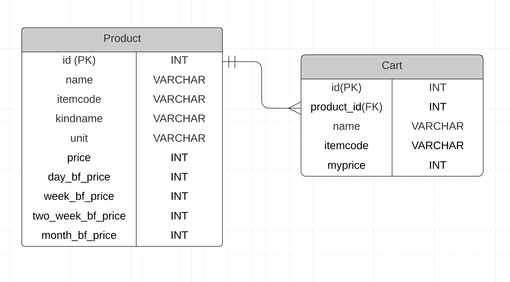

# how-is-your-cart 🛒
- 🔍 Compare your cart to official price.   
- 📊 Simple Price Comprison Web Application for Groceries

- 👀
  - https://howisyourcart.herokuapp.com/
- 🍇
  - 

## Development Env
- Flask Web Application
- (Deploy) Heroku

## DB SCHEMA

